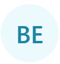

<div align="center">
  
</div>

<br />

[](https://www.npmjs.com/package/@ngneat/avvvatars)
[](https://github.com/ngneat/avvvatars/blob/master/LICENSE)
[]()
[](https://github.com/ngneat/avvvatars/compare)
[](https://github.com/prettier/prettier)
[](https://github.com/prettier/prettier)
[](https://github.com/ngneat/)
[](https://github.com/semantic-release/semantic-release)

# @ngneat/avvvatars

> Beautifully crafted unique avatar placeholder for your next angular project. Inspired from [avvvatars](https://github.com/nusu/avvvatars)

<p align="center">
 
</p>

## Compatibility with Angular Versions

<table>
  <thead>
    <tr>
      <th>@ngneat/avvvatars</th>
      <th>Angular</th>
    </tr>
  </thead>
  <tbody>
    <tr>
      <td>
        1.x
      </td>
      <td>
        >= 17
      </td>
    </tr>
  </tbody>
</table>

## Features

- 🌈 **40 Colors** - Colors are so on point that most of the projects can use it without changing it
- 💠 **60 Shapes** - Beautifully crafted shapes that are unique to your user with color combination
- 🆎 **Text or Shapes** 🔸 - Use letters (eg. JD for John Doe) or unique shapes
- 🤠 **Unique to user** - Generated avatars are unique to the string that you provide, it means if you pass janedoe@gmail.com you will always get the same avatar
- ✍️ **Customizable** - use shadows, change size, provide alternative text to display

## Installation

**With yarn**

```bash
yarn add @ngneat/avvvatars
```

**With npm**

```bash
npm install @ngneat/avvvatars
```

## Getting Started

Import @ngneat/avvvatars to your app, then use it anywhere you want.

```typescript
import { AvvvatarsComponent } from '@ngneat/avvvatars';

@Component({
  selector: 'app-root',
  standalone: true,
  imports: [AvvvatarsComponent],
  template: `
  <avvvatars value="best_user@gmail.com"></avvvatars>
  `
})
export class AppComponent {}
```

## Customization

### `value: string`

This is required for plugin to work, each value generates a random avatar to unique to this value, so each time plugin renders, you will get the same results. 

```html
<avvvatars value="best_user@gmail.com" />
```

### `displayValue?: string`

Override default text by providing displayValue

for example if you provide `value=”best_user@gmail.com”` the character output will be the first 2 letters of value which is “BE”, if you pass `displayValue=”BU”` you can override it to **BU**

```html
<avvvatars value="best_user@gmail.com" displayValue="BU" />
```

### `style?: character | shape  (default character)`

Use shape or character as avatar.

```html
<avvvatars value="best_user@gmail.com" style="character" />
<avvvatars value="best_user@gmail.com" style="avatar" />
```




### `size?: number  (default 32)`

Override default size (32px) by providing a number.

```html
<avvvatars value="best_user@gmail.com" size={32} />
```

### `shadow?: boolean  (default false)`

Enable shadow around the avatar.

```html
<avvvatars value="best_user@gmail.com" shadow={false} />
```

### `radius?: number` (default [size](#size-number-default-32))

Override the radius of the avatar, it takes `size` by default to always turn it to a circle

```html
<avvvatars value="best_user@gmail.com" radius={10} />
```

### `border?: boolean  (default false)`

Toggle border

```html
<avvvatars value="best_user@gmail.com" border={false} />
```

### `borderSize?: number  (default 2)`

Override border width

```html
<avvvatars value="best_user@gmail.com" borderSize={2} />
```

### `borderColor?: string  (default #fff)`

Override border color

```html
<avvvatars value="best_user@gmail.com" borderColor="#fff" />
```
